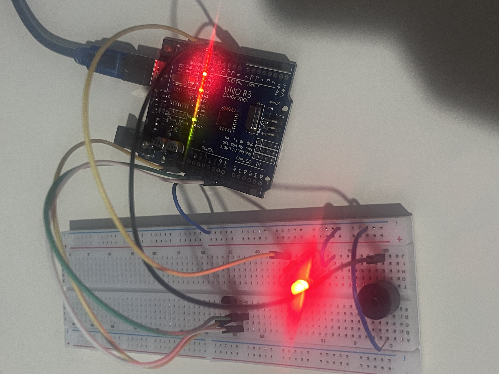

Temperature Alarm System 🌡️

This repository contains my first embedded systems project, developed to get familiar with microcontrollers and basic C++ programming using Arduino.

🔧 Tools & Technologies
Language: C++

IDE: Arduino IDE

Microcontroller: Arduino Uno

Components: LM35 Temperature Sensor, Active Buzzer, LED, and 220Ω Resistor

📘 Project Description
This project focuses on understanding:

Analog Signal Processing: Reading temperature data from an LM35 sensor.

Threshold Logic: Activating an alarm system (LED & Buzzer) when the temperature exceeds 30°C.

Hardware-Software Interaction: Bridging C++ logic with physical electronic components.

🚀 How to Run
Clone this repository.

Open the .ino file using Arduino IDE.

Connect your Arduino Uno and select the correct port.

Upload the code and monitor the Serial Monitor at 9600 baud.

📌 Status & Notes
Current Status: System logic and alarm functionality are implemented and verified.

This is a beginner-level project created for learning purposes as part of my Electrical and Electronics Engineering studies at Karabük University.

More advanced projects will be added as I continue specializing in embedded systems.
